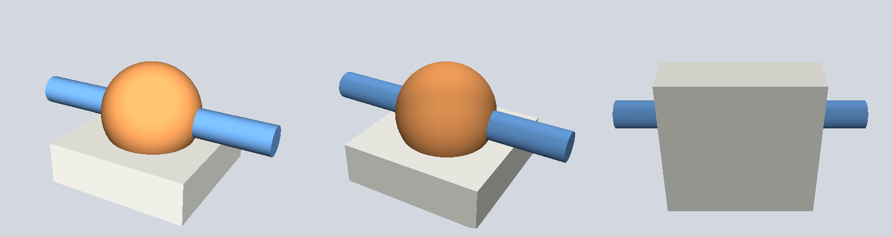

# 3d-base

3d-base draws pictures of 3D meshes from Python with no display, no OpenGL and no browser. It needs numpy, trimesh and scipy. I use it to check models for 3D printing from a script, and to give an AI assistant pictures it can judge a design from.



It also loads exported STL files and reports what is really wrong with them, after removing the zero-area triangles that CAD exporters write.

## Install

```bash
pip install 3d-base
```

In Python it is imported as `base3d`, because a Python name cannot start with a digit.

## Use

```bash
3d-base render part.stl -o part.png                  # one view, from the front right
3d-base render part.stl --view below -o below.png
3d-base render part.stl --azim 30 --elev 20 -o x.png
3d-base render part.stl --view sheet -o sheet.png    # six views in a grid
3d-base check part.stl                               # faces, bodies, closed cavities, volume
```

`3d-base check` exits with 1 when the file has a closed cavity, so it can stop a script before a print.

From Python:

```python
import trimesh
from base3d import frame_on, render, save_png, sheet

mesh = trimesh.load("part.stl")
eye, target = frame_on(mesh, azim=-45, elev=25)
save_png(render(mesh, eye, target, size=(1400, 1000)), "part.png")
save_png(sheet(mesh, views=("front", "top", "below")), "views.png")
```

`render` takes `face_colors` (one RGB colour per face, values from 0 to 1), so parts can have their own colours. It returns an RGB array, so the picture can also go to Pillow, matplotlib or anything else.

## Why not matplotlib

Matplotlib's 3D axes sort whole triangles from back to front and then draw them. When parts overlap or pass through each other, triangles come out in the wrong order, and a correct model looks broken. 3d-base keeps a depth value for every pixel, so the nearest surface always wins.

## Shading

A few choices came from looking at real pictures and finding them misleading.

- The light comes partly from the camera (`HEADLIGHT`). With only a fixed lamp, a view from below or from behind came out close to black (about a fifth of full brightness), and those views are often the ones you need.
- Curved surfaces are shaded smoothly, and real edges stay sharp. With one normal per triangle, a sphere looks like a quilt of flat facets even when the mesh is within a few microns of a true sphere, which reads as a defect that is not in the model. Normals are averaged only over neighbouring faces within 32 degrees (`CREASE_DEG`), so box corners and cut edges keep their own normal.
- The average for a corner is taken over faces close to that face's own direction, not over all faces at the vertex. The simpler version bends the normals at the rim of a cut toward the cut's walls and draws a bright spike that is not there. `corner_normals(mesh, naive=True)` returns the simpler version, so you can see the difference.
- Colour is flat per face and only the light changes across a triangle, so a colour boundary in the picture is a face boundary in the mesh.

`display_mesh(mesh)` returns the mesh with these same normals stored on its vertices. A GLB exported by trimesh carries no normals, so a web viewer such as three.js shows it unlit with smooth shading on. Exporting `display_mesh(mesh)` instead makes the viewer and the pictures agree.

## Checking an exported STL

OpenCascade (and tools built on it, such as build123d and CadQuery) writes zero-area triangles at every sphere pole. A plain sphere then reports `is_watertight=False` and two or three extra bodies. `load_clean` removes them, and after that a second body is real. A body with negative volume is a closed cavity inside the part (a socket that never reached the surface, for example).

```python
from base3d import load_clean, voids
mesh, bodies = load_clean("part.stl")
assert not voids(bodies)
```

`surface_points(mesh, n)` samples points on the surface with a fixed seed, so a step that places things from those points gives the same answer on every run.

## Speed

It is plain numpy with a loop over triangles. A part with 225,721 faces renders at 700 by 500 in 6 to 9 seconds on an M1 Max, and a part with 40,960 faces in about 1.5 seconds. For an interactive viewer use something else. For pictures in a script, a test or a report it is fast enough.

## Development

```bash
python -m venv .venv && .venv/bin/pip install -e '.[test]'
.venv/bin/pytest
python examples/make_example.py   # rebuilds docs/example.png
```

## License

MIT
